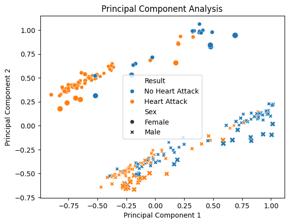
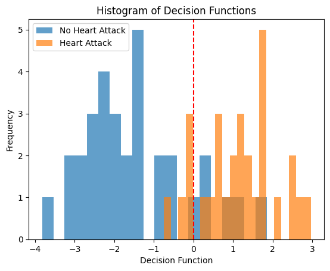

# Binary Classification for Heart Attack Prediction

## Overview

This project explores the use of various machine learning models to predict the likelihood of a heart attack based on a set of diagnostic health metrics. Using the "Heart Attack Analysis & Prediction Dataset" from Kaggle, we perform exploratory data analysis (EDA), data preprocessing, model training, and evaluation for binary classification (presence or absence of heart attack).

## Dataset

-   **Source:** [Heart Attack Analysis & Prediction Dataset (Kaggle)](https://www.kaggle.com/datasets/rashikrahmanpritom/heart-attack-analysis-prediction-dataset/data)
-   **Target Variable:** `output` (1 = Heart Attack, 0 = No Heart Attack)
-   **Features:**
    -   `age`: Age (years)
    -   `sex`: Sex (1 = male; 0 = female)
    -   `cp`: Chest pain type (0-3 scale)
    -   `trtbps`: Resting blood pressure (mm Hg)
    -   `chol`: Serum cholesterol (mg/dl)
    -   `fbs`: Fasting blood sugar > 120 mg/dl (1 = true; 0 = false)
    -   `restecg`: Resting electrocardiographic results (0-2 scale)
    -   `thalachh`: Maximum heart rate achieved
    -   `exng`: Exercise induced angina (1 = yes; 0 = no)
    -   *(Other features like 'oldpeak', 'slp', 'caa', 'thall' were present in the original dataset but might not be explicitly listed in the feature description section of the notebook, but are used)*

## Methodology

The project follows these key steps:

1.  **Data Loading & Cleaning:**
    *   Load the `heart.csv` dataset.
    *   Check for and remove duplicate entries.
    *   Verify no null values exist.
    *   Categorical features (`cp`, `restecg`) are treated as ordinal numerical features without one-hot encoding.

2.  **Exploratory Data Analysis (EDA):**
    *   Descriptive statistics overview.
    *   Visualization of feature distributions using histograms.
    *   Analysis of class balance (`output`) - found to be reasonably balanced.
    *   Analysis of gender distribution - noted a higher proportion of males.
    *   Correlation matrix heatmap to identify relationships between features and the target.
    *   Pairplots focusing on features highly correlated with the target (`exng`, `cp`, `thalachh`).

3.  **Data Preprocessing:**
    *   **Train-Test Split:** Data split into 80% training and 20% testing sets.
    *   **Normalization:** Features scaled to a [0, 1] range using `MinMaxScaler` on both training and test sets (fit only on training data).

4.  **Principal Component Analysis (PCA):**
    *   PCA performed on the training data primarily for visualization purposes.
    *   Used to plot the data in 2D, highlighting class separation and potential patterns related to gender or other features.
    *   PCA-transformed data (first 8 components) used specifically for the K-Nearest Neighbors model.

5.  **Model Training and Evaluation:**
    Four different classification models were trained and evaluated:
    *   **Logistic Regression:**
        *   L1 (Lasso) regularization used.
        *   `liblinear` solver.
        *   Hyperparameter `C` tuned using `GridSearchCV` with cross-validation.
    *   **K-Nearest Neighbors (KNN):**
        *   Trained on the first 8 principal components to mitigate the curse of dimensionality.
        *   Optimal number of neighbors (`k`) determined using cross-validation.
    *   **Support Vector Machine (SVM):**
        *   Radial Basis Function (RBF) kernel used.
        *   Hyperparameter `C` tuned using `GridSearchCV` with cross-validation.
    *   **Neural Network (NN):**
        *   Implemented using PyTorch.
        *   Simple MLP architecture (1 hidden layer, ReLU activation, Sigmoid output).
        *   Hyperparameters (learning rate, optimizer) tuned using K-Fold cross-validation. Adam optimizer was found to be best.
        *   Final model trained with tuned hyperparameters, weight decay (L2 regularization), and early stopping based on validation loss.

6.  **Model Comparison:**
    *   Accuracy scores on the test set were used to compare the performance of the different models.
    *   Confusion matrices generated for Logistic Regression and Neural Network models.
    *   Analysis of misclassified points using the PCA visualization for the Neural Network.

## Key Results & Visualizations

-   **EDA Insights:** Features like `exng` (exercise-induced angina), `cp` (chest pain type), and `thalachh` (max heart rate) showed notable correlation with the `output` variable.
-   **PCA Visualization:** Successfully visualized the data distribution in lower dimensions, showing some separation between classes and genders.
-   **Model Performance (Test Accuracy - example from notebook):**
    *   Logistic Regression: ~82.0%
    *   K-Nearest Neighbors (on PCA): ~77.0%
    *   Support Vector Machine: ~86.9%
    *   Neural Network: ~91.8%
    *   *(Note: Actual results may vary slightly depending on the train-test split seed)*
-   **Visualizations:** The analysis includes:
    *   Histograms of feature distributions.
    *   Correlation matrix heatmap.
    *   Pairplots of key features.
    *   PCA scatter plot.
    *   Confusion matrices.
    *   Neural Network training/validation loss curves.

## Conclusion

The project successfully applied and compared several machine learning models for heart attack prediction. The Neural Network and Support Vector Machine models demonstrated the highest accuracy on the test set for this particular run, significantly outperforming KNN. Logistic Regression also provided reasonably good results, indicating its effectiveness even for this relatively complex biological dataset. The EDA and PCA provided valuable insights into data characteristics and potential challenges in classification.
